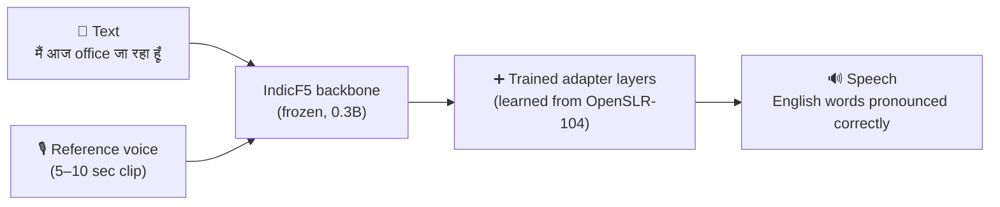

<div align="center">

# 🗣️ IndicF5 Code-Switch TTS

### Text-to-speech that speaks the way India actually talks

*"मैं आज **office** जा रहा हूँ, **morning** में एक **important meeting** है।"*

[](https://huggingface.co/Tharshan/indicf5_hindi-english_code_switch)
[](https://huggingface.co/spaces/Tharshan/indic-code-switch-tts)
[](LICENSE)

-lightgrey)

</div>

---

## 🎧 Hear the difference

Each clip plays the **original IndicF5** first (red), then **this model** (green), same sentence and same voice. 🔊 Turn your sound on.

<table>
<tr>
<td width="50%"><b>Hindi + English</b> (what it was trained for)<br>
<video src="https://github.com/user-attachments/assets/05d59c32-ff60-493b-8eb3-a04ede1f16e2" width="400" controls></video><br>
<sub>The original garbles all six English words. This model says every one of them.</sub></td>
<td width="50%"><b>Pure Hindi</b> (nothing broken)<br>
<video src="https://github.com/user-attachments/assets/4a582dad-fc76-429b-a65a-9da93e71d558" width="400" controls></video><br>
<sub>Sounds the same before and after, so normal Hindi isn't damaged.</sub></td>
</tr>
<tr>
<td><b>Pure English</b> (better, not perfect)<br>
<video src="https://github.com/user-attachments/assets/790a4760-9942-4251-87c5-be19f6883daa" width="400" controls></video><br>
<sub>Never the training goal, but a big step up from unintelligible.</sub></td>
<td></td>
</tr>
</table>

## 🌏 The surprise: languages it never heard

Trained **only on Hindi-English**, yet English words got better in other Indian languages too. Each sentence means *"I'm going to **office** today, there's an **important meeting** in the **morning**."*

<table>
<tr>
<td><b>Tamil</b><br><video src="https://github.com/user-attachments/assets/5d0b59de-534b-4228-8d9b-6ab7008f0757" width="280" controls></video></td>
<td><b>Telugu</b><br><video src="https://github.com/user-attachments/assets/0e1dde3f-1dda-4d16-8fdc-04c84d4c86ee" width="280" controls></video></td>
<td><b>Kannada</b><br><video src="https://github.com/user-attachments/assets/750a9fc0-4821-4311-90f0-63a99de3aec6" width="280" controls></video></td>
</tr>
<tr>
<td><b>Marathi</b><br><video src="https://github.com/user-attachments/assets/cd7bdfc7-5634-41cf-93f1-35542ad4adf9" width="280" controls></video></td>
<td><b>Gujarati</b><br><video src="https://github.com/user-attachments/assets/aa75ea53-5186-46cf-9a07-4a6a67d18c56" width="280" controls></video></td>
<td><b>Bengali</b><br><video src="https://github.com/user-attachments/assets/594326ee-20d0-490a-8b20-28160061b9d7" width="280" controls></video></td>
</tr>
</table>

---

## 🤔 The problem, in one sentence

Millions of Indians mix English into their own language in everyday speech: *office*, *meeting*, *project*, *phone*. Existing Indian-language voice models **mangle those English words into gibberish**.

| What you type | What the original IndicF5 says | What this model says |
|---|---|---|
| मैं आज **office** जा रहा हूँ | मैं आज **अफे** जा रहा हूँ ❌ | मैं आज **ओफिस** जा रहा हूँ ✅ |
| **morning** में एक **important meeting** है | **ओडे** में एक **टहौर का निये** है ❌ | **मॉर्णिंग** में एक **इंपोर्टेंट मीटिंग** है ✅ |
| **team** के साथ **new project discuss** करना है | **एंग** के साथ **मिफ्रय इसस** करना है ❌ | **टीम** के साथ **नी प्रोजेक्ट डिस्कस** करना है ✅ |

*(Transcribed from the generated audio with Whisper large-v3, same reference voice for both models.)*

**This project fixes that.** I fine-tuned [ai4bharat/IndicF5](https://huggingface.co/ai4bharat/IndicF5) on real Hindi-English mixed speech so it pronounces the English words properly while keeping the Hindi natural.

---

## ✨ Highlights

- 🎯 **Fixes English words in Hindi sentences.** In the test sentence, all six English words come out correctly. The original model garbles every one of them.
- 🌏 **Improves 8 other Indian languages it never saw in training.** Trained only on Hindi-English, yet English words improve in Tamil, Telugu, Bengali, Kannada, Malayalam, Marathi, Gujarati and Punjabi.
- 🛡️ **Doesn't break what already worked.** Pure Hindi and pure Tamil output are unchanged.
- 💻 **Trained on free hardware.** Two Kaggle T4 GPUs, about 10 hours.
- 📦 **One line to load.** Weights, vocabulary, model code and 10 reference voices ship in one Hugging Face repo. No gated downloads, no extra installs.

---

## 🚀 Try it in 30 seconds

**Option 1: No code.** Open the [Hugging Face Space](https://huggingface.co/spaces/Tharshan/indic-code-switch-tts), type a sentence, press generate.

**Option 2: Python.**

```bash
pip install torch torchaudio torchdiffeq x-transformers vocos librosa soundfile transformers
```

```python
from transformers import AutoModel
import soundfile as sf

model = AutoModel.from_pretrained(
    "Tharshan/indicf5_hindi-english_code_switch", trust_remote_code=True
)

ref, ref_text = model.voice("ritu_hinglish")          # pick a built-in voice
audio, sr = model.generate(
    "मैं आज office जा रहा हूँ, morning में एक important meeting है।",
    ref_audio=ref, ref_text=ref_text,
)
sf.write("out.wav", audio, sr)
```

**Built-in voices:** `ritu_hinglish`, `ta_hinglish`, `bn`, `gu`, `kn`, `ml`, `mr`, `or`, `pa`, `te`

**Want it to speak in *your* voice?** Jump to the **🎙️ Clone your own voice** section below.

> 💡 **Biggest quality tip:** use a reference voice in the same language as your text. It matters more than any other setting.

---

## 🎙️ Clone your own voice

Record yourself for about 10 seconds, and the model will speak any Hinglish sentence **in your voice**.

<table>
<tr><th>🎙️ Reference (my real voice)</th><th>🔊 Generated (voice cloned)</th></tr>
<tr>
<td><video src="https://github.com/user-attachments/assets/fb4df5ff-43d0-4a15-bda9-fdbfd3a95b73" width="380" controls></video></td>
<td><video src="https://github.com/user-attachments/assets/7af0125e-dde2-40eb-ad54-ff5ce9709b90" width="380" controls></video></td>
</tr>
<tr>
<td><sub>The model only needs the first ~10 seconds.</sub></td>
<td>Weekend पर हम सब friends के साथ Goa trip plan कर रहे हैं।</td>
</tr>
</table>

### 🛠️ Try it with your own voice

### Step 1: Record a reference clip

Use your phone's voice recorder or [Audacity](https://www.audacityteam.org/) and read one natural sentence, for example:

> *आज मेरा **weekend plan** है कि मैं **friends** के साथ **movie** देखने जाऊँगा।*

For the best results:

| ✅ Do | ❌ Avoid |
|---|---|
| 5–12 seconds long | Clips over 15 seconds (they get cut off) |
| Quiet room, phone close to your mouth | Fans, traffic, echo, background music |
| Speak naturally, at a normal pace | Whispering, shouting, reading robotically |
| Same language as the text you'll generate | A Tamil clip for Hindi text (works, but sounds worse) |
| Leave ~0.5 s of silence at the end | Cutting off mid-word |

### Step 2: Convert it to WAV

Phones usually save `.m4a` or `.mp3`. Convert to 24 kHz mono WAV:

```bash
ffmpeg -i my_recording.m4a -ar 24000 -ac 1 my_voice.wav
```

### Step 3: Write down exactly what you said

The transcript must match the recording **word for word**, including English words in English letters. This is the #1 cause of bad output.

```python
my_text = "आज मेरा weekend plan है कि मैं friends के साथ movie देखने जाऊँगा।"
```

### Step 4: Generate

```python
from transformers import AutoModel
import soundfile as sf

model = AutoModel.from_pretrained(
    "Tharshan/indicf5_hindi-english_code_switch", trust_remote_code=True
)

audio, sr = model.generate(
    "कल सुबह मेरी client के साथ call है, उसके बाद presentation ready करनी है।",
    ref_audio="my_voice.wav",
    ref_text="आज मेरा weekend plan है कि मैं friends के साथ movie देखने जाऊँगा।",
)
sf.write("me_speaking.wav", audio, sr)
```

<details>
<summary>🛠️ Output sounds wrong? Quick fixes</summary>

| Problem | Fix |
|---|---|
| Mumbled or skipped words | The transcript doesn't match the clip. Re-listen and correct it word for word. |
| Doesn't sound like me | Clip is too short or noisy. Re-record 8–10 s in a quieter room. |
| Speech is too fast or slow | Re-record at the pace you want; the model copies your pace. |
| Words from my clip appear in the output | Add ~0.5 s of silence to the end of your recording. |
| Robotic or buzzy sound | Background noise in the clip. Record closer to the mic. |

</details>

> 🔒 **Only clone voices with permission.** Your own voice is fine; someone else's needs their consent.

---

## 🧠 How it works (plain English)

IndicF5 is a *voice-cloning* TTS model: you give it a short clip of someone speaking plus some new text, and it says the new text in that voice. It had learned Indian languages well but had rarely heard English words spoken *inside* Hindi sentences, so it guessed, badly.

I taught it using [OpenSLR-104](https://openslr.org/104/), a dataset of real people speaking mixed Hindi-English. To keep training cheap and avoid erasing what the model already knew, I froze the main network and trained only small add-on layers.



---

## 📊 Results in numbers

<details>
<summary>📄 Whisper transcripts and error rates (for the technical reader)</summary>

#### Hindi-English (the training target)
All six English words in the test sentence come through correctly. The base model produces nonsense in their place. See the table at the top.

#### Pure Hindi: nothing broken
Character error rate **0.000 → 0.000**. Output is identical in quality.

#### Pure English: better, not perfect
Character error rate **0.725 → 0.209**.

| | Transcript |
|---|---|
| Input | The weather is quite pleasant today, so we are planning to visit the park in the evening. |
| Base | Anjay, aur har sone jo isse sehar se hiye |
| This model | Please send today. So we are planning to visit Titey Par. |

Pure English was never the goal (the training data is English *inside* Hindi), but the model recovers a lot of it.

#### Other languages
Input: *"I'm going to **office** today, there's an **important meeting** in the **morning**"*, translated into each language with the English words kept. **No training data for any of these.**

| Language | Base IndicF5 | This model |
|---|---|---|
| Tamil | நான் இன்னைக்கு **நாப் ஹேவ்** போறேன் **மூனேல** ஒரு **எந்தாண்ட நேயை** இருக்கு | நான் இன்னைக்கு **அவ்வேச்** செல்கிறேன் **மார்ணிங்**கல ஒரு **இம்போர்ட்டன்ட் மீட்டி** இருக்கிறது |
| Telugu | నేను ఇరోజు **నాఫె** కి వెళ్లుతున్నాను **ఉన్నే** లో ఒక **ఏహటోన** ఈ ఉంది | నేను ఇరోజు **ఓఫేస్** కి వేలుతున్నాను **మోనింగ్** లో ఒక **ఇంపోటంట్ మేటింగ్** ఉంది |
| Kannada | ನಾನು ಇವತ್ತು **ನಭಾಯ**ಗೆ ಹೋಗುತ್ತಿದ್ದೇನೆ **ಮೋಣೆ**ನಲ್ಲಿ ಒಂದು **ಹೋಣಿ ಇಯಿ** ಇದೆ | ನಾನು ಇವತ್ **ಓಫಿಸ್**ಗೆ ಹೋಗುತ್ತಿದ್ದೇನೆ **ಮೋರ್ಣಿಂಗ್** ನಲ್ಲಿ ಒಂದು **ಇಂಪಾಟಂಟ್ ಮಿಟಿಂಗ್** ಇದೆ |
| Marathi | मी आज **ओफेल** आजातोई **ओणे** मधे एक **अहोन इई** आहे | मी आज **ओफिस**ला जातोई **मौर्णिंग** मधेक **इंपोर्टेंट मीटिंग** आहे |
| Gujarati | હું આજે **અફે** જઈ રહ્યો છું **હોણે** માં એક **હોર્ચણ એહી** છે | હું આજે **ઓફેશ** જાઈ રહેઓ છું **મોર્નિંગ**માં એક **ઇંપોર્ટન્ટ મેટિંગ** છે |

See the full tables on the [model card](https://huggingface.co/Tharshan/indicf5_hindi-english_code_switch#other-languages).

**Pure-language controls** (no English at all) check whether fine-tuning damaged anything: Tamil output is character-for-character identical to the base model, and Telugu and Bengali differ by a single character.

This suggests the model learned *"how English sounds when written in an Indian script"* as a general skill, not something tied to Hindi.

> ⚠️ Plain Whisper writes correctly spoken English words in the local script (*morning* → मॉर्णिंग), so its error rates on mixed text undercount this model. Listening to the clips above is the best test.

</details>

---

## 🏋️ Training details

| | |
|---|---|
| Base model | [ai4bharat/IndicF5](https://huggingface.co/ai4bharat/IndicF5) (F5-TTS DiT, 0.3B) |
| Data | [OpenSLR-104](https://openslr.org/104/) Hindi-English |
| Method | Adapter / QLoRA, backbone frozen |
| Epochs | 20 |
| Learning rate | 5e-5 |
| Batch size | 19,200 frames (halved from the 38,400 default to fit T4 memory) |
| Gradient accumulation | 4 |
| Warmup steps | 500 |
| Hardware | 2× NVIDIA T4, 32 GB total (Kaggle) |
| Training time | ~10 hours |
| Vocabulary | 2,546 tokens, unchanged |
| Sample rate | 24 kHz |

Training and evaluation code lives in [`finetuning_indicF5/`](finetuning_indicF5/). Evaluation outputs are in [`results/`](results/).

---

## 📁 Repository structure

```
indicf5_hinglish_code_switch/
├── finetuning_indicF5/   # training + evaluation code
├── results/              # evaluation transcripts and metrics
├── samples/              # audio: base vs fine-tuned, every language
├── requirements.txt
└── README.md
```

---

## ⚠️ Limitations

- Pure English is improved but unreliable: words get dropped or garbled on longer input.
- Generates one or two sentences at a time (no automatic chunking of long text yet).
- *office* is correct in Hindi, Kannada and Marathi but still garbled in Tamil, Telugu, Gujarati and Punjabi.
- Voice sounds slightly duller than the base model, because the training audio was upsampled from a speech-recognition dataset.
- Evaluation uses one sentence per language, transcribed by a single ASR model, so treat the numbers as indicative.

## 🛣️ Roadmap

- [ ] Tamil-English fine-tune on natural code-switched speech
- [ ] Automatic sentence chunking for long text
- [ ] Larger evaluation set with human listening tests

---

## 🙏 Credits

- [ai4bharat/IndicF5](https://huggingface.co/ai4bharat/IndicF5) (MIT)
- [F5-TTS](https://github.com/SWivid/F5-TTS) (MIT)
- [OpenSLR-104](https://openslr.org/104/) Hindi-English speech corpus

## 🔒 Responsible use

Do not clone anyone's voice without their consent.

---

<div align="center">

If this project helped you, please ⭐ the repo and ❤️ the [model on Hugging Face](https://huggingface.co/Tharshan/indicf5_hindi-english_code_switch).

Made by [Tharshananth](https://github.com/Tharshananth)

</div>
